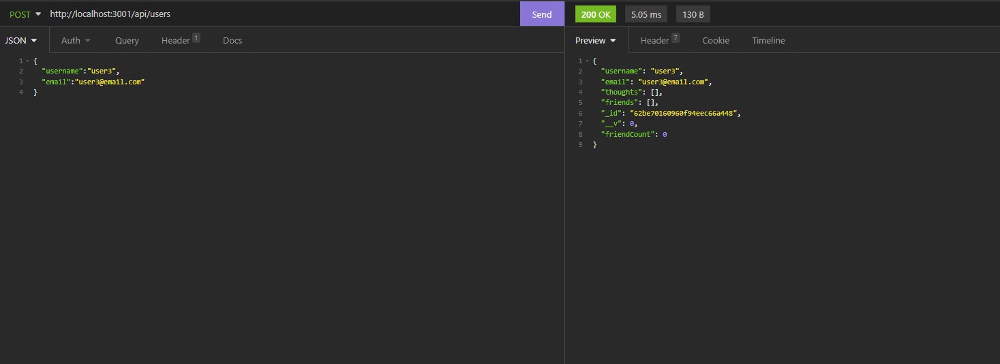

# Social Network API NoSQL

 API for a social network web application where users can share their thoughts, react to friends’ thoughts, and create a friend list. This app is built using Express.js for routing, a MongoDB database, and the Mongoose ODM.
## App details:

- A social network API
- When the user enters the command to invoke the application their server is started and the Mongoose models are synced to the MongoDB database
- When the user opens API GET routes in Insomnia for users and thoughts the data for each of these routes is displayed in a formatted JSON
- When the user tests API POST, PUT, and DELETE routes in Insomnia they are able to successfully create, update, and delete users and thoughts in their database
- When the user tests API POST and DELETE routes in Insomnia they are able to successfully create and delete reactions to thoughts and add and remove friends to a user’s friend list

### Demo Link:

Demo video available [HERE](https://drive.google.com/file/d/1r9gybX9TPbCUZoIBx7qX4-SaY8JqL8Cn/view)

